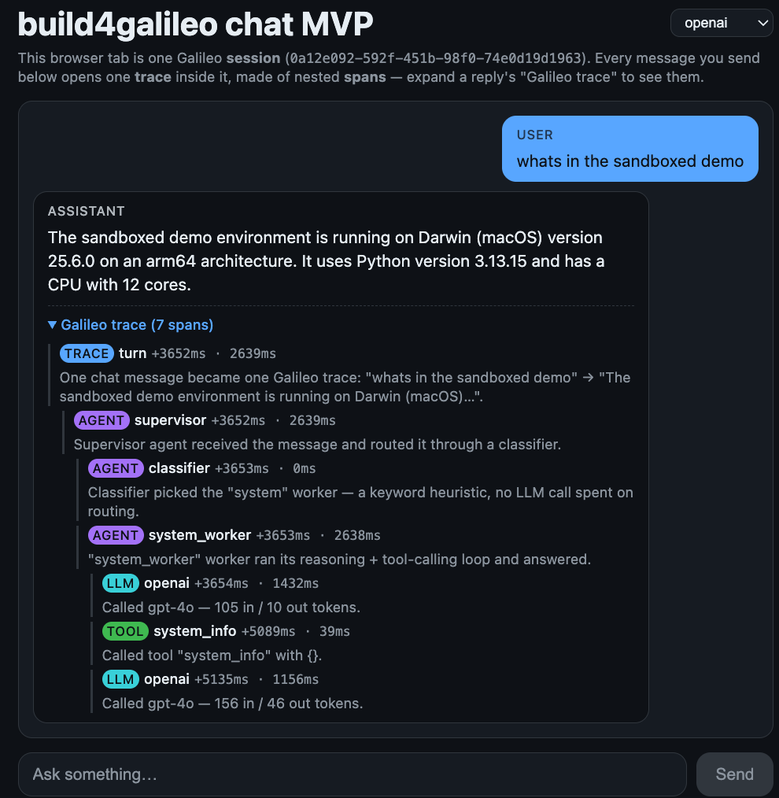

# build4galileo



A reusable, provider-agnostic pattern for building agentic AI workers,
workflows, and applications with well-structured sessions, traces, and
spans — plus a chat MVP that's the first thing built on it.

`core/` is a small, standalone library for that pattern: one composable
`Agent` primitive (router or leaf worker) instead of hardcoded per-provider
loops or a fixed agent shape, plus a provider-agnostic `LLMProvider`
interface with adapters for Anthropic, OpenAI, and Gemini. See
[`core/README.md`](core/README.md) for the design.

## What you'll build

A chat app whose agent:

1. Takes a user's question in a React chat UI.
2. Classifies it (`system` / `files` / `network` — a fast keyword
   heuristic, no extra LLM call) and hands it to a worker scoped to a
   matching system prompt and a **single** tool — classification is real
   access control, not just persona selection.
3. Calls an LLM (Anthropic, OpenAI, or Gemini — your own key; a dropdown in
   the chat UI switches between whichever you have keys for, per message)
   through a provider-agnostic interface.
4. Lets the LLM call a demo MCP server's tools — `system_info`,
   `file_search` (sandboxed, path-traversal guarded), `http_ping`
   (SSRF-guarded) — guarded by a round cap and a repeated-identical-call
   detector so a confused model can't loop forever.
5. Traces each turn to Galileo, structured as `session -> trace ->
   agent(supervisor) -> [agent(classifier), agent(worker) -> [llm, tool,
   ...]]` — every turn in one browser conversation is grouped under one
   Galileo session, auto-named from a 5-word summary of the conversation's
   opening question (e.g. `build4galileo-platform-host-running-<id>`)
   instead of a bare UUID.
6. Shows that same session/trace/span structure back in its own UI: every
   assistant reply has a collapsible "Galileo trace" — a color-coded,
   nested timeline with plain-English commentary per span (see the
   screenshot above) — built from the same trace/span events the app sends
   to Galileo, not a read-back from Galileo's API (see `app/timeline.py`
   and `Tracer.on_event` in `core/`).

```
 Browser (React chat UI)
       │
       ▼
   FastAPI app ──► supervisor Agent ──► classifier (keyword heuristic)
       │                 │
       │                 ▼
       │           worker Agent ──► LLMProvider (Anthropic / OpenAI / Gemini)
       │                 │                     │
       │                 │                     ▼ (tool calls)
       │                 └──────────► demo MCP server (stdio subprocess)
       │
       ▼
     Galileo (nested trace: supervisor → classifier + worker → llm/tool spans)
```

## Repo layout

| Path | Purpose |
|---|---|
| [`core/`](core/README.md) | Reusable `b4g-core` library: Session/Trace/Span tracer, `LLMProvider` + 3 adapters, composable `Agent`, `ToolLoopGuard` |
| `apps/chat-mvp/backend/` | FastAPI app (`/chat`, `/config`) + the demo MCP server, wiring `core` into a concrete supervisor→classifier→worker tree |
| `apps/chat-mvp/frontend/` | Vite + React + TypeScript chat UI, themed from `andrewkriley/design-system`'s `therileys-team` pattern (self-contained, dark-only token set) |
| `scripts/sync-tokens.mjs` | Pulls and resolves `therileys-team` tokens from `design-system` into `apps/chat-mvp/frontend/src/styles/tokens.css` (committed, manually re-run) |

## Prerequisites

- **Python 3.11+** and [uv](https://docs.astral.sh/uv/)
- **Node.js 20+** and npm
- Your own Anthropic, OpenAI, or Gemini API key (a billed API key, not a
  Claude.ai/ChatGPT subscription — the app calls the API directly)
- A [Galileo](https://app.galileo.ai/sign-up) account + API key

## Getting started

```
cp .env.example .env   # fill in your Galileo + at least one LLM provider key
uv sync --all-packages
cd apps/chat-mvp/frontend && npm install && cd ../../..
```

Then run **`./dev`** — a controller script at the repo root that starts
both the backend (FastAPI + demo MCP server) and the frontend (Vite) as one
command, in one terminal, and stops both cleanly on Ctrl+C:

```
./dev            # interactive menu: start both, run tests, lint, sync tokens, ...
./dev start      # start both dev servers directly, no menu
```

`./dev backend` / `./dev frontend` run just one side, if you want that
back in two terminals for some reason.

Open the frontend's local URL, pick a provider in the header dropdown, and
ask something like "what CPU does this host have?", "find the readme in
the sandbox", or "is 1.1.1.1 reachable?" — then expand the reply's "Galileo
trace" to see the session/trace/span structure right there, or check the
Galileo dashboard for the same thing.

## Testing

```
./dev test      # pytest (core + backend, offline) + frontend lint/typecheck/build
./dev lint      # ruff + eslint only
```

(or run `uv run pytest` / `npm run lint && npm run typecheck && npm run build`
directly — `./dev` is just a convenience wrapper around the same commands.)

## Known limitations

In a real multi-round tool-calling conversation, some `llm` spans could
silently fail to reach Galileo. The cause turned out to be reachable from
our side: `AnthropicProvider.append_assistant_turn` fed
the Anthropic SDK's raw response objects back into the message list used
for `logged_input`, and from round 2 of any tool-calling turn onward,
`add_llm_span` would throw a `TypeError` trying to JSON-encode them —
silently, because the Galileo SDK mutes its own `"galileo"` logger by
default. Fixed in `AnthropicProvider` (the OpenAI and Gemini adapters
already flattened their logged content and were never affected), and
`GalileoTracer` now calls `galileo.enable_console_logging()` plus a
`flush(on_error=...)` hook so any *other* Galileo ingestion failure logs
loudly instead of vanishing. What's left is inherent to the SDK, not fixed
by application code: `flush()` is designed to swallow ingestion errors
rather than raise, so a trace can still fail to reach Galileo (network
blip, a schema the ingest API rejects) without failing the chat request —
it'll just be logged now instead of silent. A local durable trace store
was considered as a further hardening measure and deliberately left out of
this MVP for simplicity; see `core/README.md`. It's an observability gap
only; the chat app's answers are correct regardless, and — new in this
version — the chat UI's own "Galileo trace" timeline gives you a
same-session way to sanity-check span shape without needing the dashboard.

## License

MIT — see [`LICENSE`](LICENSE).
